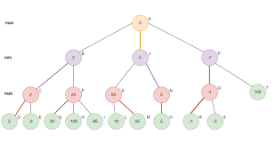

# Checkers Game with AI


A classic checkers game built with Python and Pygame, featuring an intelligent AI opponent and modern graphics.

## Features

- Interactive gameplay with classic checkers rules
- AI opponent with multiple difficulty levels
- Custom graphics and animations
- Particle effects and visual feedback
- Sound effects and background music
- Automatic piece promotion to kings
- Win condition detection

## Installation

### Prerequisites

- Python 3.7 or higher
- Pygame library

### Quick Start

1. Clone the repository:

   ```bash
   git clone https://github.com/psycocodes/checkers-pygame.git
   cd checkers-pygame
   ```

2. Install dependencies:

   ```bash
   pip install -r requirements.txt
   ```

3. Run the game:
   ```bash
   python main.py
   ```

## Screenshots

<table>
  <tr>
    <td></td>
    <td></td>
  </tr>
  <tr>
    <td></td>
    <td></td>
  </tr>
</table>

## AI Algorithm - Minimax

The game implements the Minimax algorithm with alpha-beta pruning for the AI opponent. This algorithm evaluates all possible future game states to make optimal moves.



### How it works:

- **Minimax Tree**: Explores all possible moves up to a certain depth
- **Alpha-Beta Pruning**: Eliminates branches that won't affect the final decision
- **Evaluation Function**: Scores board positions based on piece count, position, and king status
- **Difficulty Levels**:
  - Easy (Depth 2): Quick decisions, good for beginners
  - Medium (Depth 4): Balanced gameplay with moderate challenge
  - Hard (Depth 6): Deep analysis, challenging for experienced players

## Game Rules

- Players alternate turns moving pieces diagonally
- Capture opponent pieces by jumping over them
- Pieces become kings when reaching the opposite end
- Kings can move both forward and backward
- Win by capturing all opponent pieces or blocking their moves

## Controls

- **Mouse Click**: Select and move pieces
- **ESC**: Exit game or return to menu
- **Difficulty Selection**: Choose AI difficulty before starting

## Project Structure

```
checkers-pygame/
├── Assets/              # Game assets (images, sounds, fonts)
├── Checkers/            # Core game logic
│   ├── algorithm.py     # AI minimax implementation
│   ├── board.py         # Game board logic
│   ├── game.py          # Main game controller
│   └── piece.py         # Piece object and logic
├── GUI/                 # User interface components
├── main.py              # Game entry point
├── screen_manager.py    # Screen state management
└── requirements.txt     # Dependencies
```

## Technical Details

- **Language**: Python 3.7+
- **Game Engine**: Pygame 2.6.1
- **Architecture**: Modular design with separated concerns
- **Cross-Platform**: Windows, macOS, Linux support

## Contributing

Contributions are welcome! Please feel free to submit a Pull Request.

## License

This project is licensed under the MIT License - see the [LICENSE](LICENSE) file for details.

## Contact

- **Author**: [psycocodes](https://github.com/psycocodes)
- **Repository**: [checkers-pygame](https://github.com/psycocodes/checkers-pygame)
